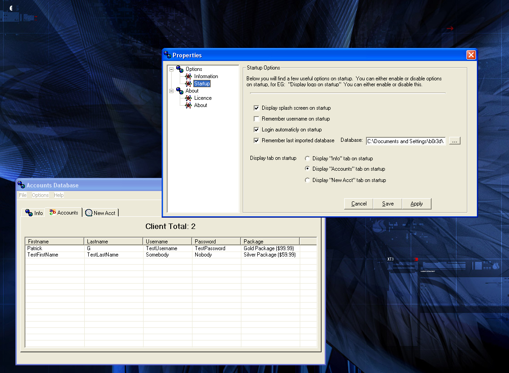



## Accounts Database \*\*UPDATED\*\*

### Description

Heh, I just can't stop thinking of new things to add to this program. I've now added the option under properties to customize your packages to sell. I used to have this program using registry for the database, but now im using a DAO database for the clients. Program has many options. Take a look, let me know what you think please. One thing i look for most is feedback and of course votes =)

Enjoy
 
### More Info
 

             |
---                |---
**Submitted On**   |2002-04-15 09:35:06
**By**             |[Patrick G](https://github.com/Planet-Source-Code/PSCIndex/blob/master/ByAuthor/patrick-g.md)
**Level**          |Advanced
**User Rating**    |4.8 (38 globes from 8 users)
**Compatibility**  |VB 6\.0
**Category**       |[Complete Applications](https://github.com/Planet-Source-Code/PSCIndex/blob/master/ByCategory/complete-applications__1-27.md)
**World**          |[Visual Basic](https://github.com/Planet-Source-Code/PSCIndex/blob/master/ByWorld/visual-basic.md)
**Archive File**   |[Accounts\_D722164152002\.zip](https://github.com/Planet-Source-Code/patrick-g-accounts-database-updated__1-33830/archive/master.zip)

